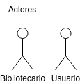
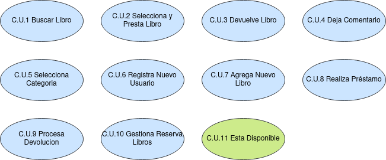

# Sistema de Gestión de Biblioteca

Desarrolla un sistema de llamado Gestión de Biblioteca que permita a los bibliotecarios buscar, prestar y devolver libros en una biblioteca. El sistema debe tener una interfaz de usuario simple (Main con menú) y proporcionar funcionalidades básicas de administración de libros, como: (obtenerInformacion (identificadorLibro),prestarLibro(identificadorLibro),devolverLibro(identificadorLibro),agregarComentario(identificadorLibro),consultarComentarios(identificadorLibro),verificarDisponibilidad(identificadorLibro)). Además el sistema permitirá dar de alta/modificación/búsqueda/eliminación de usuarios y libros.

## Índice
- [Diagrama de Casos de Uso](#caseUse)
  - [Actores](#actores) 
  - [Casos de Uso](#casos)
  - [Diagrama](#diagramaCaseUse) 
- [Diagrama de Clases](#clases)

## Diagrama de Casos de Uso 

### Actores 

|  Actor | Bibliotecario |
|---|---|
| Descripción  | Trabajador de la biblioteca. |
| Características  |  |
| Relaciones | Registra Nuevo Usuario, Agrega Nuevo Libro, Realiza Préstamo, Procesa Devolución, Gestiona Reserva Libros. |
| Referencias | C.U.6, C.U.7, C.U.8, C.U.9, C.U.10 |   
|  Notas |  |
| Autor  | Alejandro Tomás Pacheco Rodríguez |
|Fecha | 20/12/2023 |

|  Atributos |||
|---|---|---|
| Nombre  | Nombre del Bibliotecario  | String |
| Número de empleado| Número de empleado del Bibliotecario | int |
| Horario Laboral | Horario del Bibliotecario | Calendar |
|  Actor | Usuario |
|---|---|---|
| Descripción  | Usuario que acude a la biblioteca. |
| Características  |  |
| Relaciones | Buscar Libro, Selecciona y Presta Libro, Devuelve Libro, Deja Comentario, Selecciona Categoría. |
| Referencias | C.U.1, C.U.2, C.U.3, C.U.4, C.U.5 |   
|  Notas |  |
| Autor  | Alejandro Tomás Pacheco Rodríguez |
|Fecha | 20/12/2023 |

|  Atributos |||
|---|---|---|
| Nombre  | Nombre del Usuario  | String |
| Número de identificación| Número de identificacion del Usuario | int |
| Historial de Préstamos | Historial de prestamos realizados por el usuario | Préstamos[] |

### Casos de Uso 

|  Caso de Uso	CU | C.U.1:  Buscar Libro  |
|---|---|
| Fuentes  | https://github.com/jpexposito/docencia/tree/master/Primero/ETS/PROYECTO |
| Actor  |  Usuario |
| Descripción | |
| Flujo básico | |
| Pre-condiciones |   |  
| Post-condiciones  |   |  
|  Requerimientos |  |
|  Notas |   |
| Autor  | Alejandro Tomás Pacheco Rodríguez |
|Fecha | 20/12/2023 |

|  Caso de Uso	CU | C.U.2:  Selecciona y Presta Libro  |
|---|---|
| Fuentes  | https://github.com/jpexposito/docencia/tree/master/Primero/ETS/PROYECTO |
| Actor  |  Usuario |
| Descripción | |
| Flujo básico | |
| Pre-condiciones |   |  
| Post-condiciones  |   |  
|  Requerimientos | C.U.11 |
|  Notas |   |
| Autor  | Alejandro Tomás Pacheco Rodríguez |
|Fecha | 20/12/2023 |

|  Caso de Uso	CU | C.U.3:  Devuelve Libro  |
|---|---|
| Fuentes  | https://github.com/jpexposito/docencia/tree/master/Primero/ETS/PROYECTO |
| Actor  |  Usuario |
| Descripción | |
| Flujo básico | |
| Pre-condiciones |   |  
| Post-condiciones  |   |  
|  Requerimientos |  |
|  Notas |   |
| Autor  | Alejandro Tomás Pacheco Rodríguez |
|Fecha | 20/12/2023 |

|  Caso de Uso	CU | C.U.4:  Deja Comentario  |
|---|---|
| Fuentes  | https://github.com/jpexposito/docencia/tree/master/Primero/ETS/PROYECTO |
| Actor  |  Usuario |
| Descripción | |
| Flujo básico | |
| Pre-condiciones |   |  
| Post-condiciones  |   |  
|  Requerimientos |  |
|  Notas |   |
| Autor  | Alejandro Tomás Pacheco Rodríguez |
|Fecha | 20/12/2023 |

|  Caso de Uso	CU | C.U.5:  Selecciona Categoría  |
|---|---|
| Fuentes  | https://github.com/jpexposito/docencia/tree/master/Primero/ETS/PROYECTO |
| Actor  |  Usuario |
| Descripción | |
| Flujo básico | |
| Pre-condiciones |   |  
| Post-condiciones  |   |  
|  Requerimientos |  |
|  Notas |   |
| Autor  | Alejandro Tomás Pacheco Rodríguez |
|Fecha | 20/12/2023 |

|  Caso de Uso	CU | C.U.6:  Registra Nuevo Usuario  |
|---|---|
| Fuentes  | https://github.com/jpexposito/docencia/tree/master/Primero/ETS/PROYECTO |
| Actor  |  Bibliotecario |
| Descripción | |
| Flujo básico | |
| Pre-condiciones |   |  
| Post-condiciones  |   |  
|  Requerimientos |  |
|  Notas |   |
| Autor  | Alejandro Tomás Pacheco Rodríguez |
|Fecha | 20/12/2023 |

|  Caso de Uso	CU | C.U.7:  Agrega Nuevo Libro  |
|---|---|
| Fuentes  | https://github.com/jpexposito/docencia/tree/master/Primero/ETS/PROYECTO |
| Actor  |  Bibliotecario |
| Descripción | |
| Flujo básico | |
| Pre-condiciones |   |  
| Post-condiciones  |   |  
|  Requerimientos |  |
|  Notas |   |
| Autor  | Alejandro Tomás Pacheco Rodríguez |
|Fecha | 20/12/2023 |

|  Caso de Uso	CU | C.U.8:  Realiza Préstamo  |
|---|---|
| Fuentes  | https://github.com/jpexposito/docencia/tree/master/Primero/ETS/PROYECTO |
| Actor  |  Bibliotecario |
| Descripción | |
| Flujo básico | |
| Pre-condiciones |   |  
| Post-condiciones  |   |  
|  Requerimientos |  |
|  Notas |   |
| Autor  | Alejandro Tomás Pacheco Rodríguez |
|Fecha | 20/12/2023 |

|  Caso de Uso	CU | C.U.9:  Procesa Devolución  |
|---|---|
| Fuentes  | https://github.com/jpexposito/docencia/tree/master/Primero/ETS/PROYECTO |
| Actor  |  Bibliotecario |
| Descripción | |
| Flujo básico | |
| Pre-condiciones |   |  
| Post-condiciones  |   |  
|  Requerimientos |  |
|  Notas |   |
| Autor  | Alejandro Tomás Pacheco Rodríguez |
|Fecha | 20/12/2023 |

|  Caso de Uso	CU | C.U.10:  Gestiona Reserva Libros  |
|---|---|
| Fuentes  | https://github.com/jpexposito/docencia/tree/master/Primero/ETS/PROYECTO |
| Actor  |  Bibliotecario |
| Descripción | |
| Flujo básico | |
| Pre-condiciones |   |  
| Post-condiciones  |   |  
|  Requerimientos |  |
|  Notas |   |
| Autor  | Alejandro Tomás Pacheco Rodríguez |
|Fecha | 20/12/2023 |

### Diagrama 

## Diagrama de Clases 

