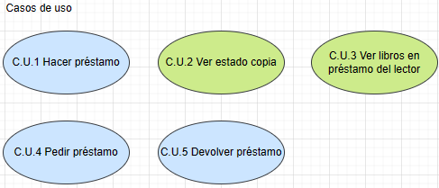
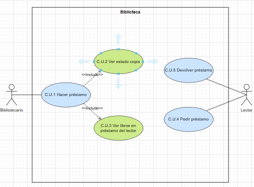
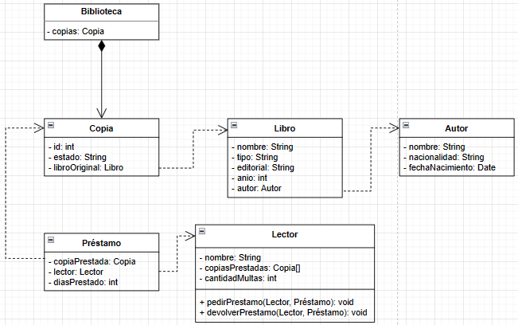

# Diagrama Hospital
Una biblioteca tiene copias de libros. Estos últimos se caracterizan por su nombre, tipo (ingeniería, literatura, informática, historia ...), editorial, año y autor.   
Los autores se caracterizan por su nombre, nacionalidad y fecha de nacimiento.  
Cada copia tiene un identificador, y puede estar en la biblioteca, prestada, con retraso o en reparación.
Los lectores pueden tener un máximo de 3 libros en préstamo.  
Cada libro se presta un máximo de 30 días, y por cada día de retraso, se impone una “multa” de dos días sin posibilidad de coger un nuevo libro.  
Realiza un diagrama de clases y añade los métodos necesarios para realizar el préstamo y devolución de libros. Realiza un diagrama de casos de usos.

## Índice
- [Actores](#Actores)
- [Casos de Uso](#CasosUso)
- [Diagrama Casos de Uso](#Diagrama)
- [Diagrama de Clases](#Clases)

## Actores 

| Actor | Bibliotecario |
| --- | --- |
| Descripción | |
| Características | |
| Relaciones | Hacer prestamo, Ver estado copia, Ver libros en préstamo del lector. |
| Referencias | C.U.1, C.U.2, C.U.3. |   
| Notas | |
| Autor | Alejandro Tomas Pacheco Rodriguez |
| Fecha | 03/12/2023 |

| Atributo | | |
| --- | --- | --- |
| Nombre | Descripción | Tipo |
| | | |

| Actor | Lector |
| --- | --- |
| Descripción | |
| Características | |
| Relaciones | Pedir préstamo, Devolver préstamo. |
| Referencias | C.U.4, C.U.5. |   
| Notas |  |
| Autor | Alejandro Tomas Pacheco Rodriguez |
| Fecha | 03/12/2023 |

| Atributo | | |
| --- | --- | --- |
| Nombre | Descripción | Tipo |
| | | |

## Casos de Uso 

| Caso de Uso | C.U.1: Hacer préstamo |
|---|---|
| Fuentes | https://github.com/jpexposito/docencia/blob/master/Primero/ETS/DIAGRAMAS/DIAGRAMAS-CLASES/Ejemplos/biblioteca.md |
| Actor | Bibliotecario |
| Descripción | |
| Flujo básico | |
| Pre-condiciones | La copia debe estar en la biblioteca y el lector que solicita el préstamo no puede tener 3 libros ya prestados |  
| Post-condiciones | |  
| Requerimientos | |
| Notas | |
| Autor | Alejandro Tomás Pacheco Rodríguez |
| Fecha | 03/12/2023 |

| Caso de Uso | C.U.2: Ver estado copia. |
|---|---|
| Fuentes | https://github.com/jpexposito/docencia/blob/master/Primero/ETS/DIAGRAMAS/DIAGRAMAS-CLASES/Ejemplos/biblioteca.md |
| Actor | Bibliotecario |
| Descripción | |
| Flujo básico | |
| Pre-condiciones | |  
| Post-condiciones | |  
| Requerimientos | |
| Notas | |
| Autor | Alejandro Tomás Pacheco Rodríguez |
| Fecha | 03/12/2023 |

| Caso de Uso | C.U.3: Ver libros en préstamo del lector. |
|---|---|
| Fuentes  | https://github.com/jpexposito/docencia/blob/master/Primero/ETS/DIAGRAMAS/DIAGRAMAS-CLASES/Ejemplos/biblioteca.md |
| Actor  | Bibliotecario |
| Descripción | |
| Flujo básico | |
| Pre-condiciones | |  
| Post-condiciones | |  
| Requerimientos | |
| Notas | |
| Autor | Alejandro Tomás Pacheco Rodríguez |
| Fecha | 03/12/2023 |

| Caso de Uso | C.U.4: Devolver préstamo. |
|---|---|
| Fuentes | https://github.com/jpexposito/docencia/blob/master/Primero/ETS/DIAGRAMAS/DIAGRAMAS-CLASES/Ejemplos/biblioteca.md |
| Actor | Lector |
| Descripción | |
| Flujo básico | |
| Pre-condiciones | |  
| Post-condiciones | |  
| Requerimientos | |
| Notas | |
| Autor | Alejandro Tomás Pacheco Rodríguez |
| Fecha | 03/12/2023 |

| Caso de Uso | C.U.5: Pedir préstamo. |
|---|---|
| Fuentes | https://github.com/jpexposito/docencia/blob/master/Primero/ETS/DIAGRAMAS/DIAGRAMAS-CLASES/Ejemplos/biblioteca.md |
| Actor | Lector |
| Descripción | |
| Flujo básico | |
| Pre-condiciones | |  
| Post-condiciones | |  
| Requerimientos | |
| Notas | |
| Autor | Alejandro Tomás Pacheco Rodríguez |
| Fecha | 03/12/2023 |

## Diagrama Caso Uso 

## Diagrama de Clases 

