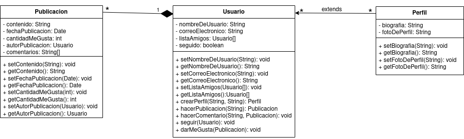

<div align = "justify">

# Red Social


Diseñe un diagrama de clases para un sistema de red social. El sistema debe permitir a los usuarios crear perfiles, publicar contenido, seguir a otros usuarios y dar "me gusta" a las publicaciones. Teniendo en cuenta la siguiente información:
- Representa a los usuarios del sistema, con los siguientes atributos: nombre de usuario, correo electrónico y lista de amigos (Otros usuarios).
- Representa las publicaciones realizadas por los usuarios, con atributos como contenido, fecha de publicación y cantidad de "me gusta". Ten en cuenta que un usuario realizará publicaciones.
- Cada usuario debe de poseer un perfil, que contiene información adicional sobre cada usuario, como la biografía y la foto de perfil.
- Se debe de gestionar la creación de perfiles de usuario, la publicación de contenido y las interacciones entre usuarios.
- Representa los comentarios realizados por los usuarios en las publicaciones, con atributos como texto y fecha. Ten en cuenta que un usuario podrá realizar comentarios sobre las publicaciones.
- Se debe de tener en cuenta los seguidores entre usuarios. Es decir, dos usuarios serán amigos si uno u otro se sigue.

Se pide: 

- [Realiza el diagrama de clases del ejercicio. (3,5 puntos)](#diagrama)
- [Realiza el pseudocódigo de la solución propuesta. (1,5 puntos)](#pseudocodigo)
- Realiza la tarea en un README.md y envia la url del repositorio.(0.5 puntos).

## Diagrama de clases <a name = "diagrama"></a>



## Pseudocodigo <a name = "pseudocodigo"></a>

### Clase Publicacion
```java
public class Publicacion {
    private String contenido = "";
    private Date fechaPublicacion = new Date;
    private int cantidadMeGusta = 0;
    private Usuario autorPublicacion = new Usuario();
    private String[] comentarios = new String[];

    public Publicacion () {}
    public Publicacion (String contenido, Usuario autorPublicacion) {
      this.contenido = contenido;
      this.autorPublicacion = autorPublicacion;
    }
}
    /**
     * Setters/Getters
     */
```

### Clase Usuario
```java
public class Usuario{
    private String nombreDeUsuario = "";
    private String correoElectronico = "";
    private Usuario[] listaAmigos = new Usuario[];
    private boolean seguido = false;

    public Usuario () {}
    public Usuario (String nombreDeUsuario, String correoElectronico) {
        this.nombreDeUsuario = nombreDeUsuario;
        this.correoElectronico = correoElectronico;
    }

    /**
     * Setters/Getters
     */

    public Perfil crearPerfil (String biografia, String fotoDePerfil) {
        Perfil nuevoPerfil = new Perfil(biografia, fotoDePerfil);
        return nuevoPerfil;
    }

    public Publicacion hacerPublicacion (String contenido) {
        Publicacion nuevaPublicacion = new Publicacion (contenido);
        return nuevaPublicacion;
    }

    public void hacerComentario (String comentario, Publicacion publicacion) {
        publicacion.setComentarios(publicacion.getComentarios() += comentario);
    }
}
```


</div>