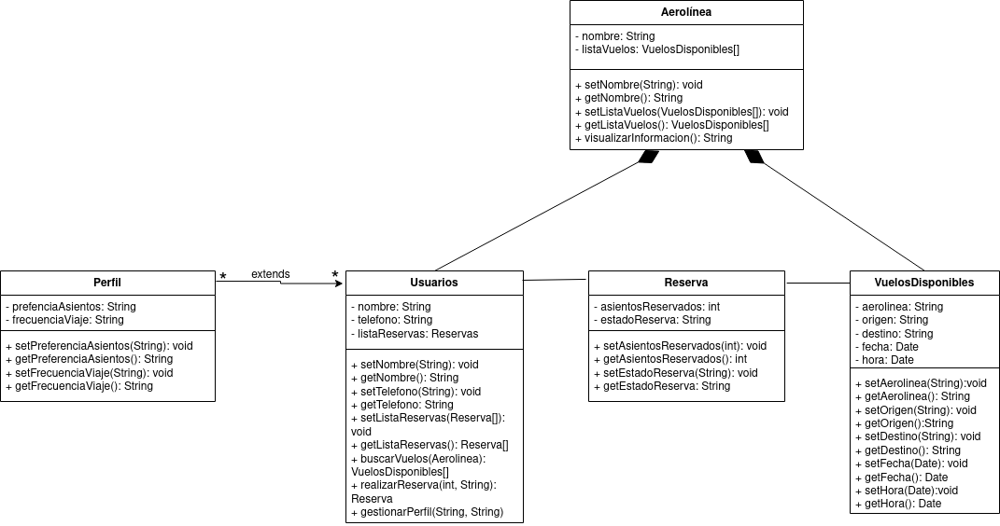

 

# Sistema de Reservas de Vuelos

Diseñe un diagrama de clases para un sistema de reservas de vuelos. El sistema debe permitir a los usuarios buscar vuelos, realizar reservas, gestionar perfiles y visualizar información sobre aerolíneas y aeropuertos. Ten en cuenta la siguiente información:

- Representa a los usuarios del sistema, con atributos como nombre, número de teléfono y lista de reservas.
- Representa los vuelos disponibles, con atributos como aerolínea, origen, destino, fecha y hora.
- Almacena la información de las reservas realizadas por los usuarios, con detalles como el número de asientos reservados y el estado de la reserva.
- Representa las aerolíneas que operan en el sistema, con atributos como nombre y lista de vuelos.
- Representa la información de los aeropuertos, como nombre, ubicación y lista de vuelos asociados.
- Almacena información adicional sobre los usuarios, como preferencias de asientos y frecuencia de viaje, siendo este su perfil.

Se pide:
- [Realiza el diagrama de clases del ejercicio. (3,5 puntos)](#diagrama) 
- [Realiza el pseudocódigo de la solución propuesta. (1,5 puntos)](#pseudocodigo)
- Realiza la tarea en un README.md y envia la url del repositorio.(0.5 puntos).

## Diagrama de Clases

## Pseudocodigo 

