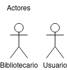

# Actores

|  Actor | Usuario |
|---|---|
| Descripción  | Usuario que acude a la biblioteca |
| Características  |  |
| Relaciones | Buscar Libro, Selecciona y Presta Libro, Devuelve Libro, Deja Comentario, Selecciona Categoría. |
| Referencias | C.U.1, C.U.2, C.U.3, C.U.4, C.U.5 |   
|  Notas |  |
| Autor  | Alejandro Tomás Pacheco Rodríguez |
|Fecha | 20/12/2023 |
|||

|  Atributos |||
|---|---|---|
| Nombre  | Nombre del Bibliotecario  | String |
| Número de empleado| Número de empleado del Bibliotecario | int |
| Horario Laboral | Horario del Bibliotecario | Calendar |
||||

|  Actor | Bibliotecario |
|---|---|
| Descripción  | Trabajador de la biblioteca. |
| Características  |  |
| Relaciones | Registra Nuevo Usuario, Agrega Nuevo Libro, Realiza Préstamo, Procesa Devolución, Gestiona Reserva Libros. |
| Referencias | C.U.6, C.U.7, C.U.8, C.U.9, C.U.10 |   
|  Notas |  |
| Autor  | Alejandro Tomás Pacheco Rodríguez |
|Fecha | 20/12/2023 |

|  Atributos |||
|---|---|---|
| Nombre  | Nombre del Bibliotecario  | String |
| Número de empleado| Número de empleado del Bibliotecario | int |
| Horario Laboral | Horario del Bibliotecario | Calendar |
|||

## Casos de Uso

|  Caso de Uso | C.U.1:  Buscar Libro  |
|---|---|
| Fuentes  | https://github.com/jpexposito/docencia/tree/master/Primero/ETS/PROYECTO |
| Actor  |  Usuario |
| Descripción | Usuario busca libro|
| Flujo básico | |
| Pre-condiciones |   |  
| Post-condiciones  |   |  
|  Requerimientos |  |
|  Notas |   |
| Autor  | Alejandro Tomás Pacheco Rodríguez |
|Fecha | 20/12/2023 |

|  Caso de Uso | C.U.2:  Selecciona y Presta Libro  |
|---|---|
| Fuentes  | https://github.com/jpexposito/docencia/tree/master/Primero/ETS/PROYECTO |
| Actor  |  Usuario |
| Descripción | Usuario selecciona y presta un libro |
| Flujo básico | |
| Pre-condiciones |   |  
| Post-condiciones  |   |  
|  Requerimientos | C.U.11 |
|  Notas |   |
| Autor  | Alejandro Tomás Pacheco Rodríguez |
|Fecha | 20/12/2023 |

|  Caso de Uso | C.U.3:  Devuelve Libro  |
|---|---|
| Fuentes  | https://github.com/jpexposito/docencia/tree/master/Primero/ETS/PROYECTO |
| Actor  |  Usuario |
| Descripción | Usuario devuelve el libro |
| Flujo básico | |
| Pre-condiciones |   |  
| Post-condiciones  |   |  
|  Requerimientos |  |
|  Notas |   |
| Autor  | Alejandro Tomás Pacheco Rodríguez |
|Fecha | 20/12/2023 |

|  Caso de Uso | C.U.4:  Deja Comentario  |
|---|---|
| Fuentes  | https://github.com/jpexposito/docencia/tree/master/Primero/ETS/PROYECTO |
| Actor  |  Usuario |
| Descripción | Usuario deja un comentario del libro |
| Flujo básico | |
| Pre-condiciones |   |  
| Post-condiciones  |   |  
|  Requerimientos |  |
|  Notas |   |
| Autor  | Alejandro Tomás Pacheco Rodríguez |
|Fecha | 20/12/2023 |

|  Caso de Uso | C.U.5:  Selecciona Categoría  |
|---|---|
| Fuentes  | https://github.com/jpexposito/docencia/tree/master/Primero/ETS/PROYECTO |
| Actor  |  Usuario |
| Descripción | Usuario selecciona categorias de libro |
| Flujo básico | |
| Pre-condiciones |   |  
| Post-condiciones  |   |  
|  Requerimientos |  |
|  Notas |   |
| Autor  | Alejandro Tomás Pacheco Rodríguez |
|Fecha | 20/12/2023 |

|  Caso de Uso | C.U.6:  Registra Nuevo Usuario  |
|---|---|
| Fuentes  | https://github.com/jpexposito/docencia/tree/master/Primero/ETS/PROYECTO |
| Actor  |  Bibliotecario |
| Descripción | Bibliotecario registra un nuevo usuario |
| Flujo básico | |
| Pre-condiciones |   |  
| Post-condiciones  |   |  
|  Requerimientos |  |
|  Notas |   |
| Autor  | Alejandro Tomás Pacheco Rodríguez |
|Fecha | 20/12/2023 |

|  Caso de Uso | C.U.7:  Agrega Nuevo Libro  |
|---|---|
| Fuentes  | https://github.com/jpexposito/docencia/tree/master/Primero/ETS/PROYECTO |
| Actor  |  Bibliotecario |
| Descripción | Bibliotecario agrega un nuevo libro |
| Flujo básico | |
| Pre-condiciones |   |  
| Post-condiciones  |   |  
|  Requerimientos |  |
|  Notas |   |
| Autor  | Alejandro Tomás Pacheco Rodríguez |
|Fecha | 20/12/2023 |

|  Caso de Uso | C.U.8:  Realiza Préstamo  |
|---|---|
| Fuentes  | https://github.com/jpexposito/docencia/tree/master/Primero/ETS/PROYECTO |
| Actor  |  Bibliotecario |
| Descripción | Bibliotecario realiza un prestamo |
| Flujo básico | |
| Pre-condiciones |   |  
| Post-condiciones  |   |  
|  Requerimientos |  |
|  Notas |   |
| Autor  | Alejandro Tomás Pacheco Rodríguez |
|Fecha | 20/12/2023 |

|  Caso de Uso | C.U.9:  Procesa Devolución  |
|---|---|
| Fuentes  | https://github.com/jpexposito/docencia/tree/master/Primero/ETS/PROYECTO |
| Actor  |  Bibliotecario |
| Descripción | Bibliotecario procesa devolucion |
| Flujo básico | |
| Pre-condiciones |   |  
| Post-condiciones  |   |  
|  Requerimientos |  |
|  Notas |   |
| Autor  | Alejandro Tomás Pacheco Rodríguez |
|Fecha | 20/12/2023 |

|  Caso de Uso | C.U.10:  Gestiona Reserva Libros  |
|---|---|
| Fuentes  | https://github.com/jpexposito/docencia/tree/master/Primero/ETS/PROYECTO |
| Actor  |  Bibliotecario |
| Descripción | Bibliotecario gestiona una reserva de libros |
| Flujo básico | |
| Pre-condiciones |   |  
| Post-condiciones  |   |  
|  Requerimientos |  |
|  Notas |   |
| Autor  | Alejandro Tomás Pacheco Rodríguez |
|Fecha | 20/12/2023 |

## Diagrama

